<!-- <h1 align="center">Hi 👋, I'm Shaw</h1> -->

  

 <table>
   <tr>
     <td rowspan=2>  </td>
     <td> 
	      
     </td>
   </tr>
   <tr>
	   <td></td> 
   </tr>
   <tr>
	   <td rowspan="2"></td> 
   </tr>
   <tr>
	   <td></td> 
   </tr>
 </table>

<!-- 
  
 

  

  
 -->

<!--
**Shaw75/Shaw75** is a ✨ _special_ ✨ repository because its `README.md` (this file) appears on your GitHub profile.

Here are some ideas to get you started:

- 🔭 I’m currently working on ...
- 🌱 I’m currently learning ...
- 👯 I’m looking to collaborate on ...
- 🤔 I’m looking for help with ...
- 💬 Ask me about ...
- 📫 How to reach me: ...
- 😄 Pronouns: ...
- ⚡ Fun fact: ...
-->
