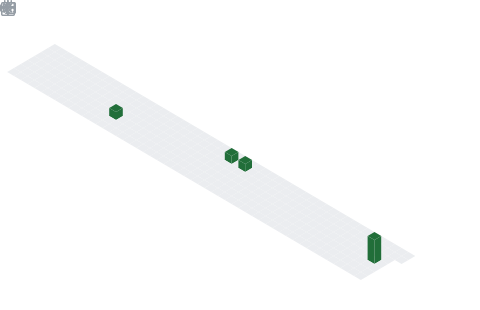

<!-- Profile views -->

  

  <table>
    <tr>
      <td rowspan="2">
        
      </td>
      <td>
        
      </td>
    </tr>
    <tr>
      <td>
        
      </td>
    </tr>
    <tr>
      <td rowspan="2">
        
      </td>
      <td>
        
      </td>
    </tr>
    <tr>
      <td align="center">
        
         
        Most repos are private tbh.
      </td>
    </tr>
  </table>

